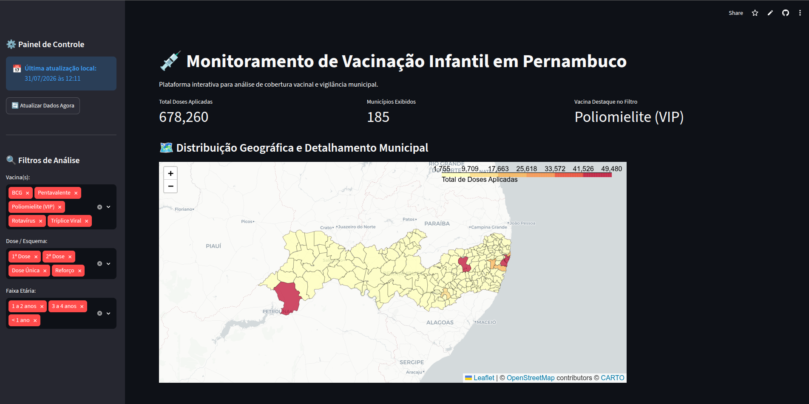

# 💉 Monitoramento de Vigilância Vacinal Infantil — Pernambuco (PE)

[](https://www.python.org/)
[](https://streamlit.io/)
[](https://fastapi.tiangolo.com/)
[](https://duckdb.org/)
[]()

Plataforma de **Engenharia de Dados e Analytics** desenvolvida para o monitoramento, espacialização e análise da cobertura de vacinação infantil nos **185 municípios do Estado de Pernambuco**.

O projeto conta com um pipeline automatizado sob a **Arquitetura Medallion**, consumo e armazenamento performático em formato `.parquet`, interface geodashboard interativa em **Streamlit** com mapas coropléticos (Folium), e exposição de dados via **API REST (FastAPI)**.

---
## 🌐 Aplicação On-line & Demonstração

> **Acesse a aplicação ao vivo:** [🔗 Dashboard de Vigilância Vacinal Infantil - PE](https://vacinacaoinfantilpe-ajzqccn6ddgta9g2s8oe5v.streamlit.app/)




---

## 🏛️ Arquitetura da Solução (Pipeline Medallion)

A solução segue os princípios de separação de responsabilidades e qualidade de dados da Arquitetura Medallion:

1. **Camada Bronze (Raw):** Armazena a ingestão bruta extraída das fontes públicas de saúde pública em formato de colunas comprimido `.parquet`.
2. **Camada Silver (Cleaned):** Processa e limpa os dados brutos (formatação de datas, padronização de nomes de municípios via caixa alta/trim e validação dos códigos IBGE de Pernambuco).
3. **Camada Gold (Aggregated):** Consolida os dados agregando o volume de doses por município, vacina, dose (esquema vacinal) e faixa etária para pronto consumo de ferramentas analíticas.

---

## 🛠️ Tecnologias Utilizadas

* **Linguagem:** Python 3.10+
* **Motor de Dados / ETL:** DuckDB & Pandas
* **Formatos de Armazenamento:** Apache Parquet
* **Dashboard / UI:** Streamlit & Plotly
* **Geoprocessamento / Mapas:** Folium & Streamlit-Folium (GeoJSON IBGE)
* **API REST:** FastAPI & Uvicorn

---

## 📂 Estrutura do Repositório

* `.streamlit/config.toml` — Configurações visuais do Streamlit.
* `data/bronze/` — Camada Bronze (Parquet Bruto).
* `data/silver/` — Camada Silver (Parquet Limpo).
* `data/gold/` — Camada Gold (Parquet Agregado).
* `geo/pe_municipios.json` — Malha geográfica GeoJSON dos 185 municípios de PE.
* `pipeline/fetcher.py` — Ingestão, checagem de versão e camada Bronze.
* `pipeline/etl.py` — Processamento Medallion (Silver & Gold).
* `pipeline/api.py` — API REST pública (FastAPI).
* `app.py` — Interface do Geodashboard (Streamlit).
* `requirements.txt` — Dependências do projeto.
* `README.md` — Documentação do projeto.

---

## 🚀 Como Instalar e Executar Localmente

### Pré-requisitos
* Python 3.10 ou superior instalado.
* Git para clonar o repositório.

### Passo 1: Clonar o Repositório e Criar Ambiente Virtual
```bash
# Clonar o projeto
git clone [https://github.com/SEU-USUARIO/vacinacao_infantil_pe.git](https://github.com/SEU-USUARIO/vacinacao_infantil_pe.git)
cd vacinacao_infantil_pe

# Criar ambiente virtual (.venv)
python -m venv .venv

# Ativar o ambiente virtual
source .venv/bin/activate
```

### Passo 2: Instalar Dependências
```bash
pip install -r requirements.txt
```

### Passo 3: Baixar a Malha Geográfica de Pernambuco
```bash
curl -s "[https://raw.githubusercontent.com/tbrugz/geodata-br/master/geojson/geojs-26-mun.json](https://raw.githubusercontent.com/tbrugz/geodata-br/master/geojson/geojs-26-mun.json)" -o geo/pe_municipios.json
```


### Passo 4: Executar a Aplicação
Você pode executar o Dashboard e a API simultaneamente em terminais separados:

* Para rodar o Geodashboard (Streamlit):
```bash
streamlit run app.py
```
Acesse no seu navegador em: http://localhost:8501

* Para rodar a API REST (FastAPI):
```bash
uvicorn pipeline.api:app --reload
```
Acesse a documentação Swagger da API em: http://127.0.0.1:8000/docs

## ℹ️ Nota Técnica: Execução da Versão Atual (Mock / Dados Sintéticos)
Para garantir alta disponibilidade (SLA), navegação fluida em tempo real no dashboard e evitar interrupções durante auditorias técnicas decorrentes de quedas frequentes ou bloqueios nos servidores do governo (HTTP 500 / Rate Limit / Timeout no portal OpenDATASUS/RNDS), a versão corrente de demonstração utiliza um Gerador de Dados Sintéticos de Alta Fidelidade (Mocking) implementado via DuckDB dentro do arquivo pipeline/fetcher.py.

Características da Versão Atual:
* Volumetria Realista: Respeita a proporcionalidade populacional dos 185 municípios de PE (ex: Recife, Caruaru e Petrolina com volumes condizentes).
* Fidelidade de Esquema: Reproduz fielmente a estrutura oficial da RNDS (Rede Nacional de Dados em Saúde) com os nomes reais de vacinas infantis (Tríplice Viral, BCG, Poliomielite, Pentavalente, Rotavírus), doses (1ª Dose, 2ª Dose, Reforço, Dose Única) e faixas etárias (< 1 ano, 1 a 2 anos, 3 a 4 anos).
* Pipeline Operacional Completo: Executa todas as etapas de ingestão, transformação Parquet Medallion e re-agregação dinâmica ao clicar em "Atualizar Dados Agora".

## 🔌 Como Migrar para Dados 100% Reais de Produção
A arquitetura do projeto foi desenhada para desacoplar a camada de UI/Analytics da fonte de dados. Para conectar a aplicação à base oficial em tempo real da RNDS ou a outra API de saúde pública (como InfoDengue/Fiocruz), basta alterar a função baixar_dados_pe() no arquivo pipeline/fetcher.py para ler o endpoint oficial:

```bash
# Exemplo de substituição em pipeline/fetcher.py para dados reais
import duckdb

def baixar_dados_pe_real():
    URL_OFICIAL_RNDS = "[https://caminho-oficial-dados-abertos.saude.gov.br/pe.parquet](https://caminho-oficial-dados-abertos.saude.gov.br/pe.parquet)"
    
    con = duckdb.connect(database=':memory:')
    query = f"""
        CREATE TABLE bronze_pe AS 
        SELECT 
            vacina_codigo_municipio::VARCHAR AS codigo_ibge,
            vacina_nome_municipio AS municipio,
            vacina_nome AS vacina,
            vacina_descricao_dose AS dose,
            paciente_faixa_etaria AS faixa_etaria,
            vacina_data_aplicacao AS data_aplicacao,
            1 AS doses_aplicadas
        FROM read_parquet('{URL_OFICIAL_RNDS}')
        WHERE vacina_uf = 'PE' AND paciente_idade < 5
    """
    con.execute(query)
    con.execute("COPY bronze_pe TO 'data/bronze/vacinacao_infantil_pe.parquet' (FORMAT PARQUET)")
    con.close()
```
Como as camadas Silver, Gold, o Dashboard e a API REST consomem diretamente o padrão Parquet gerado na camada Bronze, nenhum outro arquivo do sistema precisará ser alterado.

## 📌 Funcionalidades Principais do Dashboard
* Filtros Combinados: Análise por vacina, esquema vacinal (dose) e faixa etária simultaneamente.
* Mapa Coroplético Interativo: Gradiente de cores dinâmico por volume de aplicação municipal.
* Popup HTML Detalhado: Ao clicar em qualquer município no mapa, o sistema exibe a lista discriminada e auditável de cada vacina aplicada naquele local.
* KPIs Dinâmicos e Top 10: Métricas consolidadas e gráfico interativo (Plotly) com escala ajustada automaticamente.